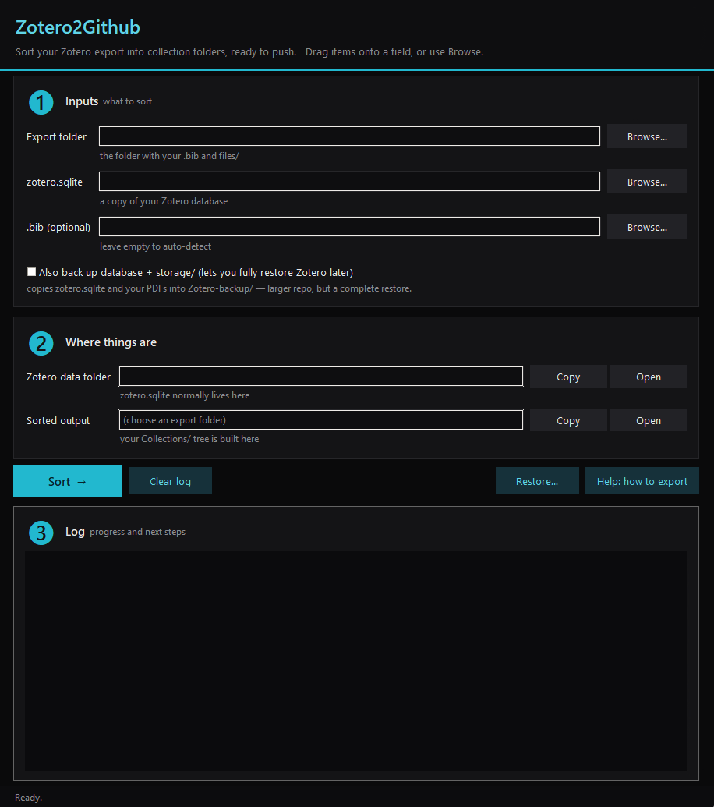
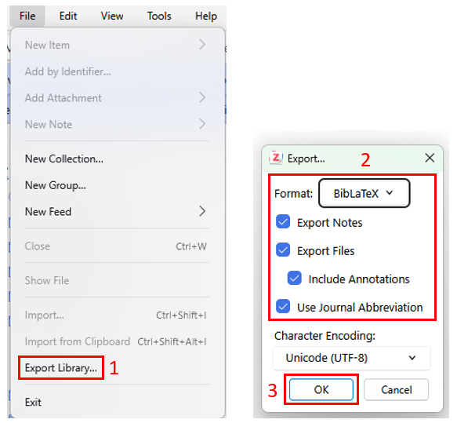

# Zotero2Github



Back up your Zotero library — references **and** PDFs — in a private GitHub
repository, and recreate your Zotero collections as folders so the repo is easy
to browse.

The easiest way is the **app** (`scripts/zotero_gui.py`): point it at your Zotero
export, click **Sort**, and it builds a `Collections/` tree ready to push. You can
also do everything [by hand with git](#doing-it-without-the-app) — the app just
saves you the manual steps.

> **Keep the repository private.** Research PDFs are usually copyrighted, so this
> is a personal backup, not a way to share papers. (This repo itself contains only
> the guide and the scripts, no papers.)

## What you need

- **Zotero** and a **GitHub account**.
- **Python 3.8+** to run the app or the scripts.
- **git** to push (and optionally the GitHub CLI `gh` to create the repo).

## 1. Export from Zotero

In Zotero, go to `File > Export Library` (or right-click a single collection and
choose `Export Collection` to back up just that part).

- Choose the format **BibLaTeX** (or Better BibLaTeX if you have the plugin).
- Tick **Export Files**. This copies your PDFs next to the `.bib`.
- Save into a new, empty folder.



You get a folder with a `.bib` file (your references) and a `files/` folder (the
PDFs, in numbered subfolders). This folder becomes your repository.

A BibLaTeX export is **flat**: it does not record which collection each item was
in. To rebuild your collection tree, the app reads it from Zotero's own database,
`zotero.sqlite` (found under
`Edit > Settings > Advanced > Files and Folders > Show Data Directory`, usually
`%USERPROFILE%\Zotero\zotero.sqlite` on Windows, `~/Zotero/zotero.sqlite` elsewhere).

## 2. Sort with the app

```bash
python scripts/zotero_gui.py
```

1. **Export folder** — the folder from step 1 (with the `.bib` and `files/`).
2. **zotero.sqlite** — your database. The app opens it **read-only**, so you can
   point at the live file even while Zotero is open.
3. Press **Sort**.

The app builds a `Collections/` tree, rewrites the file paths inside the `.bib`,
and removes the now-redundant `files/`:

```
Collections/
  A. Machine Learning/
    A1. Fundamentals/
    A2. CNN/
  B. Optics/
  C. Misc/
MyBib.bib
```

An item in several collections is copied into each; anything it can't match by
title goes to `Collections/(Unfiled)/`.

When it finishes, the **log prints the exact git commands** (or website steps) to
push the folder — the app never runs git for you. See
[Push to GitHub](#3-push-to-github) below.

> **Tip:** tick **"Also back up database + storage/"** if you want a *faithful*
> restore later — see [Restore on another computer](#restore-on-another-computer).

The app uses only Tkinter, which ships with Python — nothing to install. For
drag-and-drop (drop a folder or file onto a field) add the optional extra:

```bash
pip install tkinterdnd2
```

## 3. Push to GitHub

1. Create a **private** repo at <https://github.com/new> (no README or .gitignore;
   your folder already has files). Or with the CLI: `gh repo create my-zotero-library --private`.
2. In a terminal opened in your sorted export folder:

   ```bash
   git init
   git branch -M main
   git add -A
   git commit -m "My Zotero library"
   git remote add origin https://github.com/YOU/my-zotero-library.git
   git push -u origin main
   ```

The first push can take a few minutes with many PDFs; after that only changes are
sent. No terminal? Use GitHub Desktop, or the repo's **Add file > Upload files**
page.

### Updating later

Re-export from Zotero into the same folder, run **Sort** again, then:

```bash
git add -A
git commit -m "Update"
git push
```

## Restore on another computer

The `Collections/` tree and `.bib` are great for **browsing**, but they cannot
rebuild a full Zotero library: a BibLaTeX export has no collection information, and
the PDFs are renamed by title rather than kept in Zotero's `storage/` layout. The
collection tree, tags and notes live only in `zotero.sqlite`.

So to clone your whole library onto another machine, also back up the two things
Zotero actually needs: the **database** and the **`storage/`** folder.

**Make the backup.** Tick **"Also back up database + storage/"** before pressing
Sort, or on the command line:

```bash
python scripts/zotero_sync.py --repo . --db /path/to/zotero.sqlite --backup
```

This writes a `Zotero-backup/` folder (a consistent online snapshot of
`zotero.sqlite` plus a copy of `storage/`) next to your `Collections/`. It is safe
to run while Zotero is open. Because it copies every PDF a second time the repo
gets larger — use [Git LFS](https://git-lfs.com) for big libraries.

**Restore on the other machine.**

1. `git clone` your repo (and `git lfs pull` if you used LFS).
2. **Close Zotero.**
3. In the app, click **Restore…**, choose the cloned `Zotero-backup/` folder and
   your Zotero data folder, then confirm. The old `zotero.sqlite` and `storage/`
   are renamed to `*.old-N` (never deleted), so you can undo by hand.
4. Reopen Zotero — collections, tags, notes and PDFs are all back.

> Restore **overwrites** that machine's Zotero library, so it is for cloning onto
> a fresh or empty profile, not for merging into an existing one.

## Doing it without the app

You never have to run the app. The sorting is a plain script, and the push is
plain git.

**Sort from the command line:**

```bash
python scripts/zotero_sync.py --repo . --db /path/to/zotero.sqlite
```

Or use the wrappers, which also commit and push for you. Copy `zotero_sync.py` and
either `update.ps1` (Windows) or `update.sh` (macOS/Linux) into the root of your
repository next to the `.bib` and `files/`, do a fresh export, then run:

```powershell
pwsh ./update.ps1            # -ZoteroDb "D:\path\to\zotero.sqlite" if elsewhere
```
```bash
./update.sh                  # ZOTERO_DB="/path/to/zotero.sqlite" ./update.sh
```

**Skip collections entirely.** A flat backup is already useful — just `git init`,
`git add -A`, `git commit`, `git push` the raw export (step 3). The `Collections/`
tree is optional.

## Troubleshooting

**A file is over 100 MB.** GitHub refuses single files larger than 100 MB. Use
[Git LFS](https://git-lfs.com):

```bash
git lfs install
git lfs track "*.pdf"
git add .gitattributes
```

Files between 50 and 100 MB only get a warning and still upload.

**"Filename too long" on Windows.** Long collection names can pass the
260-character limit:

```bash
git config core.longpaths true
```

**The repo is very large.** GitHub still takes it, but pushes slow down past about
1 GB. Export only the collections you actually need.

**Nothing matched.** The app matches by title, so make sure the database is the
same profile you exported from. Anything unmatched ends up in
`Collections/(Unfiled)/`.

**"Already sorted."** Sort consumes `files/` to build `Collections/`. To sort
again, re-export from Zotero (Export Files on) into a fresh folder.
